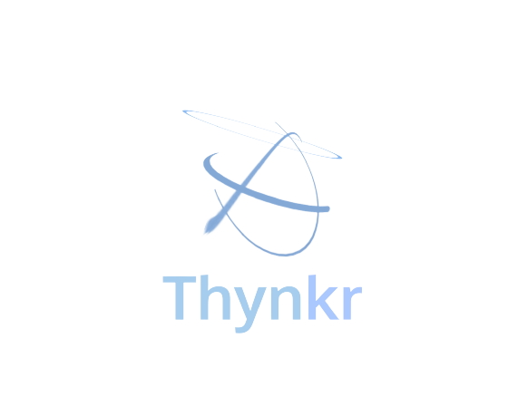

<!--
*** Thanks for checking out the Best-README-Template. If you have a suggestion
*** that would make this better, please fork the repo and create a pull request
*** or simply open an issue with the tag "enhancement".
*** Don't forget to give the project a star!
*** Thanks again! Now go create something AMAZING! :D
-->

<!-- PROJECT SHIELDS -->
<!--
*** I'm using markdown "reference style" links for readability.
*** Reference links are enclosed in brackets [ ] instead of parentheses ( ).
*** See the bottom of this document for the declaration of the reference variables
*** for contributors-url, forks-url, etc. This is an optional, concise syntax you may use.
*** https://www.markdownguide.org/basic-syntax/#reference-style-links
-->
[![Contributors][contributors-shield]][contributors-url]
[![Forks][forks-shield]][forks-url]
[![Stargazers][stars-shield]][stars-url]
[![Issues][issues-shield]][issues-url]
[![MIT License][license-shield]][license-url]

<!-- PROJECT LOGO -->
 

  

<h3 align="center">Thynkr</h3>

  

    A learning software
     
    <a href="https://github.com/Westsi/thynkr"><strong>Explore the docs »</strong></a>
     
     
    <a href="https://github.com/Westsi/thynkr">View Demo</a>
    ·
    <a href="https://github.com/Westsi/thynkr/issues">Report Bug</a>
    ·
    <a href="https://github.com/Westsi/thynkr/issues">Request Feature</a>
  

<!-- TABLE OF CONTENTS -->

  
Table of Contents

  <ol>
    <li>
      <a href="#about-the-project">About The Project</a>
      <ul>
        <li><a href="#built-with">Built With</a></li>
      </ul>
    </li>
    <li>
      <a href="#getting-started">Getting Started</a>
      <ul>
        <li><a href="#prerequisites">Prerequisites</a></li>
        <li><a href="#installation">Installation</a></li>
      </ul>
    </li>
    <li><a href="#usage">Usage</a></li>
    <li><a href="#roadmap">Roadmap</a></li>
    <li><a href="#contributing">Contributing</a></li>
    <li><a href="#contact">Contact</a></li>
    <li><a href="#acknowledgments">Acknowledgments</a></li>
  </ol>

<!-- ABOUT THE PROJECT -->
## About The Project

This is a learning software that is being developed by Westsi. It aims to help you with planning study, taking and storing notes, and practicing subjects with flashcards. It also has an inbuilt forum for users to find help.

(<a href="#top">back to top</a>)

### Built With

* [SQLite](https://sqlite.org/)
* [React.js](https://reactjs.org/)
* [Flask](https://flask.palletsprojects.com)

(<a href="#top">back to top</a>)

<!-- GETTING STARTED -->
## Getting Started

### Prerequisites

### Installation

(<a href="#top">back to top</a>)

<!-- USAGE EXAMPLES -->
## Usage

TODO

(<a href="#top">back to top</a>)

<!-- ROADMAP -->
## Roadmap

- [ ] Finish up Planner
- [ ] Improve security
- [ ] Add third-party login auth
- [ ] Add file storage functionality
    - [ ] Taking and storing notes

See the [open issues](https://github.com/Westsi/thynkr/issues) for a full list of proposed features (and known issues).

(<a href="#top">back to top</a>)

<!-- CONTRIBUTING -->
## Contributing

Contributions are what make the open source community such an amazing place to learn, inspire, and create. Any contributions you make are **greatly appreciated**.

If you have a suggestion that would make this better, please fork the repo and create a pull request. You can also simply open an issue with the tag "enhancement".
Don't forget to give the project a star! Thanks again!

1. Fork the Project
2. Create your Feature Branch (`git checkout -b feature/AmazingFeature`)
3. Commit your Changes (`git commit -m 'Add some AmazingFeature'`)
4. Push to the Branch (`git push origin feature/AmazingFeature`)
5. Open a Pull Request

(<a href="#top">back to top</a>)

<!-- CONTACT -->
## Contact

Westsi - westsi@protonmail.com

Project Link: [https://github.com/Westsi/thynkr](https://github.com/Westsi/thynkr)

(<a href="#top">back to top</a>)

<!-- ACKNOWLEDGMENTS -->
## Acknowledgments

* [Westsi](https://github.com/Westsi)
* 
* 

(<a href="#top">back to top</a>)

<!-- MARKDOWN LINKS & IMAGES -->
<!-- https://www.markdownguide.org/basic-syntax/#reference-style-links -->
[contributors-shield]: https://img.shields.io/github/contributors/Westsi/thynkr.svg?style=for-the-badge
[contributors-url]: https://github.com/Westsi/thynkr/graphs/contributors
[forks-shield]: https://img.shields.io/github/forks/Westsi/thynkr.svg?style=for-the-badge
[forks-url]: https://github.com/Westsi/thynkr/network/members
[stars-shield]: https://img.shields.io/github/stars/Westsi/thynkr.svg?style=for-the-badge
[stars-url]: https://github.com/Westsi/thynkr/stargazers
[issues-shield]: https://img.shields.io/github/issues/Westsi/thynkr.svg?style=for-the-badge
[issues-url]: https://github.com/Westsi/thynkr/issues
[license-shield]: https://img.shields.io/github/license/Westsi/thynkr.svg?style=for-the-badge
[license-url]: https://github.com/Westsi/thynkr/blob/master/LICENSE.txt
